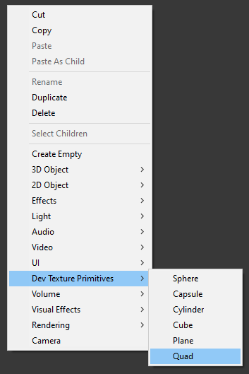
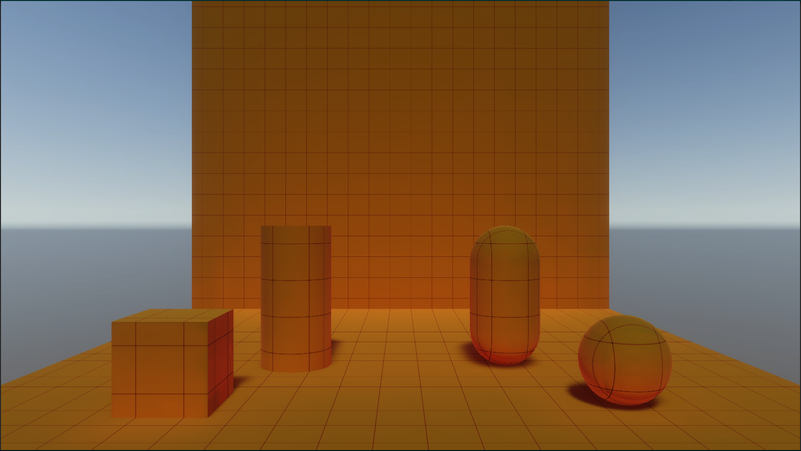
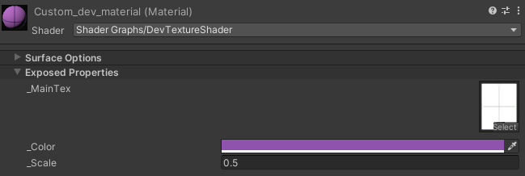

# Dev Texture Primitives

To create a Dev Texture Primitive, right click the hierarchy and select:
```
Dev Texture Primitive > #PRMITIVETYPE#
```

 

That's it!

# Demo

A demo scene is available [here](../Editor/Resources/DevTexturePrimitives/Scenes/Demo/Demo.unity):

```
Editor/Resources/DevTexturePrimitives/Scenes/Demo/Demo.unity
```




# Material Properties

The color, texture and scale of the material is all exposed in the inpector. You can find and edit these properites [here](../Editor/Resources/DevTexturePrimitives/Materials/dev_material.mat):

```
Editor/Resources/DevTexturePrimitives/Materials/dev_material.mat
```

