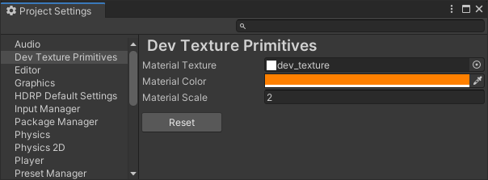

# Dev Texture Primitives

To create a Dev Texture Primitive, right click the hierarchy and select:
```
Dev Texture Primitive > #PRMITIVETYPE#
```

 

That's it!

# Demo

A demo scene is available as part of a sample pack which you can import through the package manager. Also included is an alternative dev texture.


# Material Properties

The texture, color, and scale of the material are all exposed in the Project Settings and may be customized if you wish.

